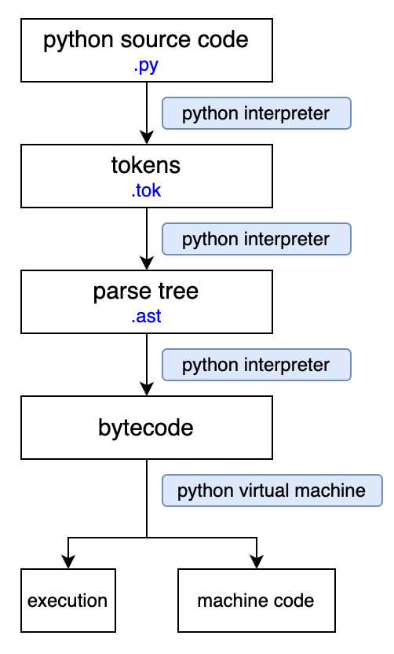

# Overview
Python is a high-level, interpreted, and general-purpose programming language.

# Interpretation
Python is an interpreted language. Python code is executed line by line with an interpreter at runtime. This is in contrast to compiled languages where the code is translated into machine code before execution. The interpreted nature of Python allows for dynamic and interactive coding, making it suitable for tasks like prototyping and scripting.

## Process

1. Source Code:
You write your Python code in a high-level language, which is the source code.
2. Tokenization and Parsing:
The Python interpreter first tokenizes the source code, breaking it down into individual elements or tokens. It then parses these tokens to create a parse tree, which represents the syntactic structure of the code.
   - In Python, the tokenize module can be used to generate tokens from a source code file or string. 
    ```python
    import tokenize
    from io import BytesIO
    
    source_code = "print('Hello, world!')"
    tokens = tokenize.tokenize(BytesIO(source_code.encode('utf-8')).readline)
    
    for token in tokens:
        print(token)
    ```
   - Python's ast module can be used to generate an Abstract Syntax Tree (AST), which is a type of parse tree.
    ```python
    import ast
    
    source_code = "print('Hello, world!')"
    tree = ast.parse(source_code)
    
    ast.dump(tree)
    ```
3. Bytecode Generation:
The Python interpreter generates an intermediate code called bytecode from the parse tree. Bytecode is a low-level representation of the code, specific to the Python Virtual Machine (PVM).
   - Some languages, like Java with its bytecode, provide explicit intermediate code that can be saved to files for further inspection. However, in the case of Python, the bytecode is typically not saved as a separate file unless explicitly requested. To see the bytecode in Python, you can use the dis module:
    ```python
    import dis
    def example_function():
        print('Hello, world!')
    dis.dis(example_function)
    ```
4. Interpreter Execution:
The Python interpreter then executes the bytecode line by line. It translates each bytecode instruction into machine code or directly interprets it, depending on the specific implementation of the Python interpreter.

## Python runtime environment
### Python Virtual Machine (PVM)
The PVM abstracts the underlying hardware, providing a layer of virtualization that allows Python code to be platform-independent. It interprets or, in some implementations, compiles bytecode to machine code, making it possible for Python programs to run on various operating systems without modification.

# Data Structure
## Differences between List and Tuple
- List:
  - **Mutability**: Lists are mutable, meaning you can modify their contents (add, remove, or modify elements) after the list is created.
  - **Syntax**: Lists are created using square brackets `[ ]`, examples: `my_list = [1, 2, 3, 'abc']`.
  - **Performance**: Lists, being mutable, may require more memory and can have a slightly slower performance compared to tuples.
- Tuple:
  - **Mutability**: Tuples are immutable, which means once a tuple is created, you cannot change its values.
  - **Syntax**: Tuples are created using parentheses `( )`, examples: `my_tuple = (1, 2, 3, 'abc')`.
  - **Performance**: Tuples are generally more memory-efficient and can offer better performance in certain scenarios due to their immutability.


## Stack
While Python does not have a dedicated stack data structure, a list can effectively serve as a stack. A stack operates on the principle of FILO (First In, Last Out), where elements are added and removed from the top of the stack.

```python
stack = []

stack.append(2) # push

stack.pop() # pop

len(stack) # length

top = stack[-1] # top
```