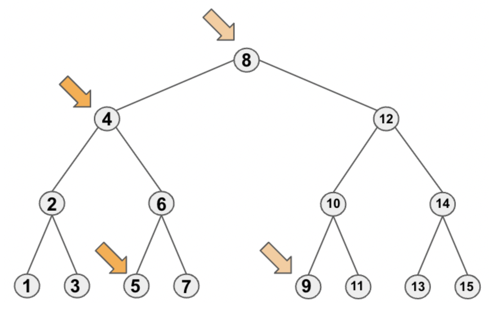

# algorithms
## tree
### binary tree
#### inorder traversal

The sequence of inorder traversal in a binary tree is depicted in the illustration below:


To simplify, the traversal order follows the sequence of the left subtree, the current node, and its right subtree.

##### recursion in inorder traversal
The recursive pattern for traversing the tree in the inorder fashion is as follows:
```python
from typing import Optional
import TreeNode

def inorder(node: Optional[TreeNode]) -> None:
    if node:
        inorder(node.left)
        # handle with the current node
        inorder(node.right)
```
This recursive approach ensures that the left subtree is traversed first, followed by the current node, and finally, the right subtree.

##### stack in inorder traversal
A stack can serve as an alternative to the recursive approach.

Three key points to consider when using a stack for inorder traversal:

- When a node is popped, it signifies that its entire left subtree has been traversed.
- After popping a node, its right subtree should be added to the stack.
- Null nodes should not be pushed onto the stack.
