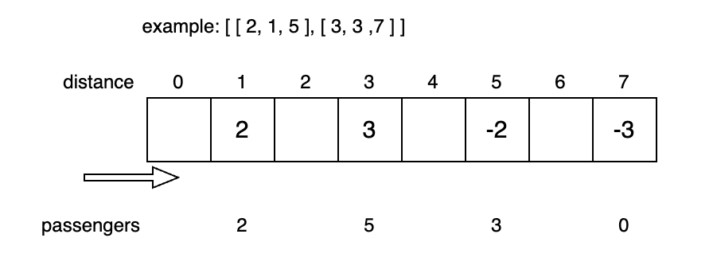

# algorithms
## differences array
The differences array tracks the number of passengers picked up or dropped off at specific locations.

## min heap
This solution draws parallels with the approach in [meeting room ii](../Meeting_Rooms_II/readme.md#min-heap), The nuance lies in representing each node of the min heap as a list with two integers. The first element denotes the drop-off location, while the second signifies the count of departing passengers.