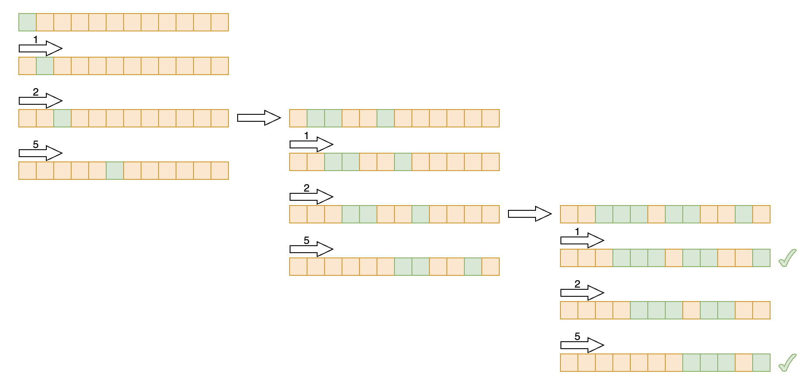

# skills
## bit manipulation
### bit manipulation in accumulating amount
In this question, the objective is to accumulate coins to reach a specific required amount. The strategy employed for optimization involves utilizing bitwise manipulation to save both time and memory.

Refer to the provided image for a visual representation of the bit move strategy:

Here's how it works:

- The initial position of the bit 1 represents the starting amount.
- Each time a coin is accumulated, the bit 1 is shifted to the right.
