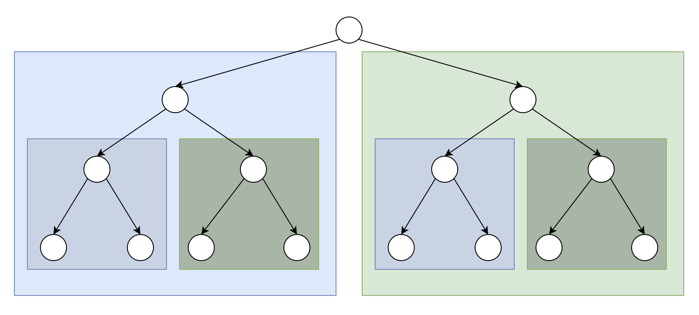

# algorithms
## tree
### binary tree
#### inorder traversal
##### recursion in inorder traversal
This method follows the pattern explained in detail here: [readme of binary tree inorder traversal](../Binary_Tree_Inorder_Traversal/readme.md#recursion-in-inorder-traversal).

The image below illustrates that for a current node, its left subtree (blue section) is traversed first, followed by its right subtree (green section).

As a result, the variable prev consistently points to the "last node" of the current node's left subtree.

For a thorough understanding, please delve into the comment in the code.

##### stack in inorder traversal