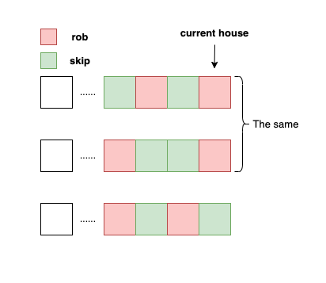

# Algorithm
## Dynamic Programming
This problem falls within the category of standard dynamic programming challenges. The `dp` list is designed to maintain a record of the maximum attainable value for a robber, starting from the first house and progressing up to the current one.

To illustrate, `best_robbery[3]` signifies the maximum value that the robber can accumulate by robbing houses from `house[0]` to `house[3]`.

# Caveat
## Misinterpretation of the `dp` Array
Initially, I mistakenly believed that the robber had three distinct robbery strategies, as depicted in the accompanying image:

This misinterpretation led to an error in my approach, as I incorrectly assumed that the `dp` array should signify "The maximum value if this house is robbed," needlessly complicating the problem.
