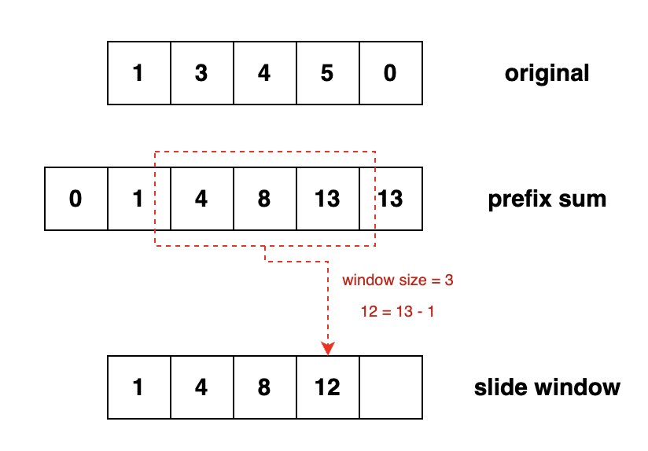
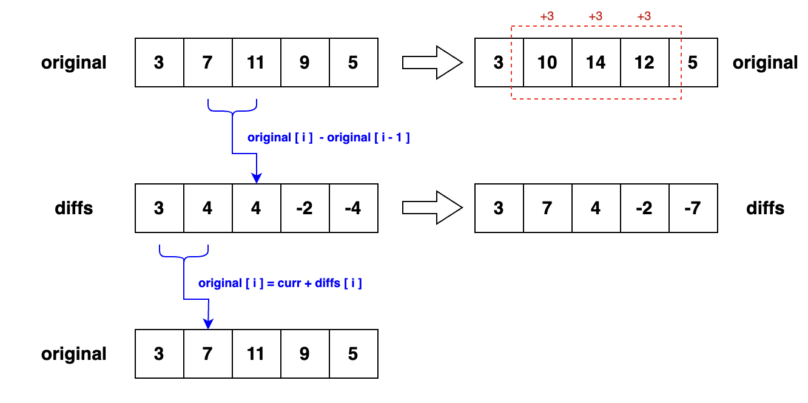

# Languages
## Python
### Copy an array
When copying an array in Python, there are two main methods:

```python
import copy

original = []

shallow_copy = original[:]  # Shallow copy
deep_copy = copy.deepcopy(original)  # Deep copy
```

Shallow copying, done through `original[:]`, is notably faster than deep copying. In testing on Leetcode, shallow copying completes within approximately 1 second, whereas deep copying takes about 4 seconds.

However, a drawback of shallow copying is that while it creates a new list, any nested lists or objects within the original list remain referenced in the copied list. Modifications to these nested elements will affect both the original and copied lists, as they share the same objects.


# Algorithms
## Prefix Sum
The prefix sum array is a new array where each value represents the sum of all elements before (including itself) in the original array.

It's particularly useful for swiftly calculating the sum within sliding windows.



## Unordered Difference Array
In the differences array (denoted as `diffs`), defined from the original array `original`, each `diffs[i]` is computed as `original[i] - original[i - 1]`. The primary application scenario for the difference array is the frequent modification of elements within a specific interval of the original array. For instance, to increment elements in the range `[i, j)` by `x`, instead of modifying all elements in this range, simply update `diffs[i] = diffs[i] + x` and `diffs[j] = diffs[j] - x`.

