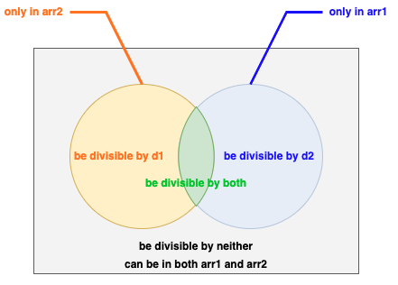

# Overview
Suppose there exists a variable `x` and a range $[1, x]$, where:
1. Some numbers are divisible only by `divisor1`.
2. Some numbers are divisible only by `divisor2`.
3. A subset of numbers can be divided by both `divisor1` and `divisor2`.

The relationship between these sets is illustrated in the Venn diagram below:

To proceed, we must first calculate:

- The count of numbers exclusively divisible by `divisor1`, denoted as `only_arr1`. 
- The count of numbers exclusively divisible by `divisor2`, denoted as `only_arr2`. 
- The count of numbers that can be accommodated in both `arr1` and `arr2`, denoted as `both_arr`.

Subsequently, we employ the `check` function to assess whether the range $[1, x]$ satisfies all specified conditions.

The value of `x` should be iteratively reduced using the binary search algorithm.

# Types
## Minimize the maximum value
To address 'Minimize the maximum value' questions, a crucial component is the 'check' function. This function takes a variable `x` (typically a numerical value) as an input parameter and assesses whether it satisfies all specified conditions, returning a Boolean output.

Subsequently, a binary search algorithm is applied to iteratively reduce the value of `x` in order to minimize it.
